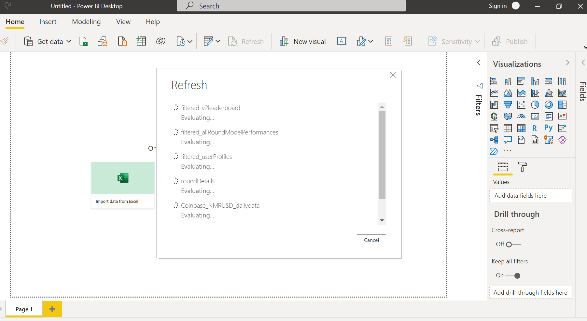
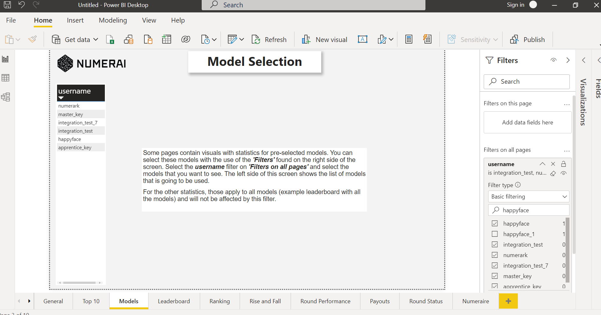

# Numerai Statistics Retrieval and Report
This repository contains a Numerai Statistics Retrieval and Reporting solution for the [Numerai Classic Tournament](https://numer.ai)

This repository contains the following projects:

- Numerai classic statistics reporting (PowerBI)
- Numerai period statistics retrieval (C#)
- Weekly statistics export files (parquet / pdf)

The solution is mainly meant to be used on a long-term basis (weekly, monthly) and should not be seen as a dashboard solution with live data. As such, exports will be automatically refreshed on a weekly basis, and can be used for the PowerBI report or for other purposes. The data used in the report is based on the numerai api (GraphiQl) for all the models in the classic tournament.

## Report pages
The report for classic contains the following pages and visuals:

- General
  - Resolving rounds: status, total at stake, total payout, correlation
  - Resolved rounds, status, total at stake, total payout, correlation
  - All rounds, total staked, total payouts, correlation
- Top 10
  - Top 10 medal score (alltime / average)
  - Top 10 most earned NMR (alltime / average)
  - Top 10 most earned NMR vs Stake % (alltime / average)
- Models
  - Model selection page
- Leaderboard
  - Leaderboard statistics filterd on your models
  - Leaderboard statistics for all models
- Ranking
  - Ranking overview for your models (corr, mmc, fnc)
- Rise and Fall
  - Correlation rank changes
  - MMC rank changes
  - 13wk return changes
- Round Performance
  - Round performance for your models (corr (percentile), mmc (percentile),fnc (percentile)
- Payouts
  - Payout performance for your models
  - Payout performances for all models
  - Total selected stakes, netto flow Nmr, payouts
- Round Status
  - Total stakes per round number
  - Total at stake per round number
  - Total payout per round number
  - Payout factor per round number
- Numeraire
  - Extracted Price data from Coinbase

A lot of the pages also contains slicers based on model selection, round numbers, dates, stake amounts etc.

## Disclaimer
No guarantees are given that the data and visuals that are being produced by the projects found in this repository are correct!! It could very well be that the source data contains errors or bugs are still present in this solution. As such, if this solution is used for financial incentives (staking / strategy /etc ) you are using it at your own risk :-)

## Issues, Contact
If you encounter any problem or have suggestions, feel free to open an issue or contact me at Numerai (orum / rocketchat / dm). My handle at RocketChat is 'QE', my handle in the forum is 'qeintelligence'.

## Technologies used
The report makes use of PowerBI Desktop which can be found [here](https://powerbi.microsoft.com/en-us/downloads/). The tool is a free to use app for both personal use or for commercial companies. PowerBI Service (and premium) require a license and Office365 environment, and provide the of sharing (B2B, B2C) but are not required for this solution.

The statistics retrieval is based on C# project and makes use of the GraphiQl endpoints provided by Numerai.

## Dashboard in Numerbay
The report is now also available in PowerBI Service! (testing phase). The report link is availabe at Numerbay and also is integrated into the main page of the website as iFrame solution. Go to [Numerbay](https://numerbay.ai/) and check out the excellent work they put into the website.

The direct link of the latest dashboard available can be found in [this textfile](https://raw.githubusercontent.com/jos1977/numerai_statistics/main/ClassicDashboardLink.txt)

## Screenshots
If you want to have a quick peek on what kind of pages there are available check out this [page](https://github.com/jos1977/numerai_statistics/tree/main/documentation/screenshots.md).

## Hardware Requirements and Installation
The PowerBI Desktop requirements are : Windows or Mac hardware, 8Gb should be sufficient for this report
PowerBI Desktop download link is [here](https://aka.ms/pbiSingleInstaller)
Just download the installer and run this, you don't need any Microsoft account for this solution.

The C# project requires [Visual Studio](https://visualstudio.microsoft.com/downloads/) or [Visual Studio Code](https://code.visualstudio.com/download).

## Export files
The parquet export files are updated on a weekly basis and can be found [here](https://github.com/jos1977/numerai_statistics/tree/main/classic/parquet). These contain all data from the following numerai endpoints:
 - V3Userprofile
 - roundSubmissionPerformances
 - V2Leaderboard
 - V2RoundDetails

In addition also Numerai statistics are retrieved from Coinbase.

## Retrieve Classic Statistics
The retrieval of the statistics and uploading of parquet files to git is done in 4 steps which are explained next.

### Retrieve statistics from Numerai
The initial step is retrieving the data from numerai endpoint (https://api-tournament.numer.ai/), for this the C# project RetrieveClassicStatistics is used. This is .NET5 based, and should run fine on Windows/Linux based hardware which has the .net5 runtime installed. In my case I am using Ubuntu 18.04/20.04. The endresult of running the console application are CSV export files.

### Retrieve Coinbase Numeraire statistics
In addition also some coinbase statistics are retrieved, for this Python is used, an example can be found [here](https://github.com/jos1977/numerai_statistics/blob/main/classic/src/Python/NumerairePriceData.ipynb).

### Convert CSV to Parquet
Next step is to convert the CSV to Parquet-files for size reduction purposes. 
I looked at various solutions but could not find a decent working package for C#, instead the Python Pandas works just out of the box and superfast!
You can see the example [here](https://github.com/jos1977/numerai_statistics/blob/main/classic/src/Python/ConvertCSVToParquet.ipynb).

### Commit/Push Parquet to Git
The final step is to make sure the parquet files are in the git repository. There is the option to use Git Data Api, however didnt take the time to get this working (in C#). Instead I just used the easy approach of using [GitPython](https://github.com/gitpython-developers/GitPython) which just works without any problem at all. See [here](https://github.com/jos1977/numerai_statistics/blob/main/classic/src/Python/Sync_Git.ipynb) for the example python script on how to handle this.

## Power BI Report usage
### First time
After PowerBI Desktop is installed you can open the report pbit template from the repository, this is the [file](https://github.com/jos1977/numerai_statistics/blob/main/classic/pbi/NumeraiClassicStatistics.pbit).

The report template doesn't contain any data yet and will start refreshing immediately (using parquet files from this repository). This will take several minutes.

### Model selection
After this you can select your own models that you want to analyse in the page 'Models'. Follow the instructions there and after that save the report locally (as a .pbix file). This is the report you can work with from now and refresh weekly. If a new version of the template is released just redo the earlier steps.

### Refresh
Data refresh on the repository is planned on a daily basis, at 02.00 UTC time. Power BI Report in Power BI Service is refreshed at 06.00 UTC (after data retrieval pipelines should be finished). You can refresh your own report simply by clicking on the 'Refresh' button in the menu.

## Finished
- Initial setup Power BI Report + retrieval application
- Initial setup Github Repo
- Fully automate statistics retrieval (including parquet)
- Release the C# project, statistics retrieval
- PowerBI Report: add dates to visuals where roundnumber is used on X-axis
- Include Prediction Scenarios page: MMC selection scenarios
## Future Work
- Automate data retrieval pipeline start after numerai scores reported ready.
- Automate PowerBI Service report refresh after data pipeline retrieval finished
- PowerBI Report: investigate option to compare selected/all models against example_model (corr/mmc/fnc diff, performance diff)
- PowerBI Report: option to filter ranking increase statistics based on 20 rounds submissions yes/no
- Visual cleanup of PowerBI report
- Include additional Top 10 rankings : 20wk / 5wk correlation/mmc rankings
## Long Term
- Signals Report and Statistics retrieval?
